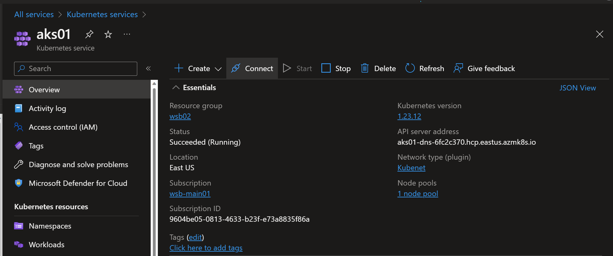

  
  
  

# Connect with kubectl

## Connect with kubectl to Your cluster in Azure

#### In this lab you will just connect yourself using kubectl to the AKS cluster in Azure

## Task 1: Open Cloud Shell and Connect to kluster
1. Open Cloud Shell
2. On the AKS Service click Connect - you will the commands to connect to the cluster

3. You will see two commands at the top, the most interesting to You is the second one, startig with ``az get credentials``
4. Run the commend in the Cloud Shell. If you are succesfull, you should see similar output:
``Merged "aks01" as current context in /home/michal_furmankiewicz/.kube/config``
5. Run ``kubectl cluster-info`` command and the output save in the report from the lab.
6. You can move to ex. 1

## END LAB

  
