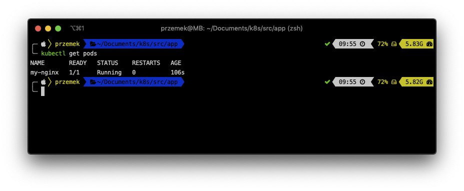
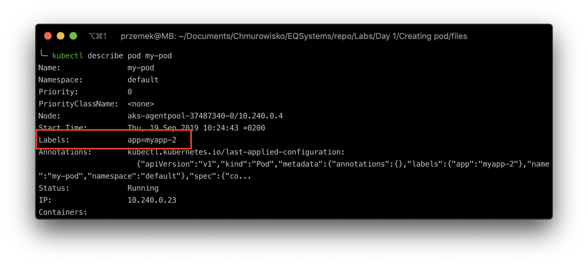
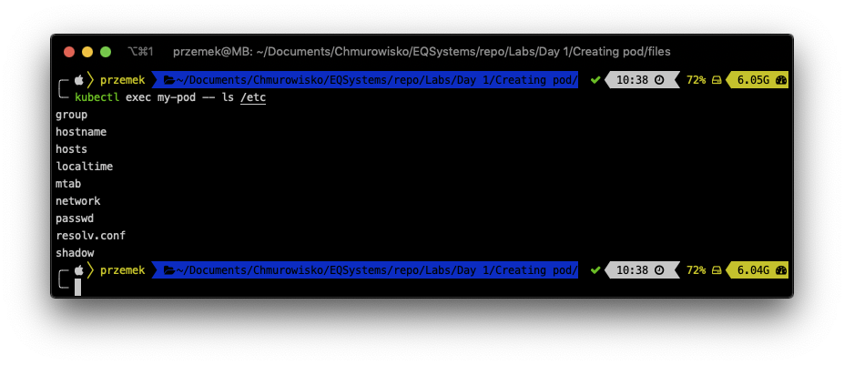
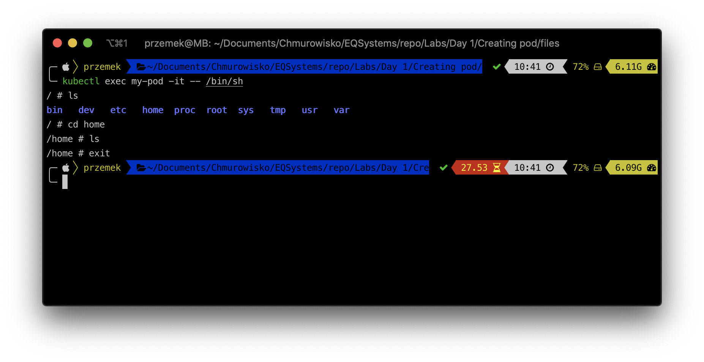

<br><br>
<br><br>
<br><br>

# Creating pod

## LAB Overview

#### In this lab you will create a Kubernetes pod

## Task 1: Checking kubectl and cluster status


1. Open a terminal of your choice.
2. Type ``kubectl version`` and press **Enter**.
You should get an output similiar to:

``Client Version: version.Info{Major:"1", Minor:"14", GitVersion:"v1.14.3", GitCommit:"5e53fd6bc17c0dec8434817e69b04a25d8ae0ff0", GitTreeState:"clean", BuildDate:"2019-06-06T01:44:30Z", GoVersion:"go1.12.5", Compiler:"gc", Platform:"darwin/amd64"}
Server Version: version.Info{Major:"1", Minor:"14", GitVersion:"v1.14.6", GitCommit:"96fac5cd13a5dc064f7d9f4f23030a6aeface6cc", GitTreeState:"clean", BuildDate:"2019-08-19T11:05:16Z", GoVersion:"go1.12.9", Compiler:"gc", Platform:"linux/amd64"}
``

3. To check if there are any nodes available, eype ``kubectl get nodes`` and press **Enter**.
You should get at least one node.

## Task 2. Creating a pod.

In this task you will create your simple pod using CLI.

1. Still in the terminal type
``
kubectl run my-nginx --restart=Never --image=nginx:1.7.9`` and press **Enter**.
2. Check if there is any pod created by typing: ``kubectl get pods``.
You should get at least one pod running.


## Task 3. Editing and getting pod details.

1. Type ``kubectl describe pods my-nginx`` and press **Enter**.
Look into pod details.
2. Export pod definition by typing: ``kubectl get pod my-nginx -o yaml > my_pod_definition.yaml``
3. Check if there is a definition by typing ``ls`` and pressing **Enter**.
4. You can examine the definition by typing ``cat my_pod_definition.yaml``.
5. Edit existing pod by typing ``kubectl edit pod my-nginx``.
Pod definition should open in an editor. Edit the file by replacing line:
``- image: nginx:1.7.9`` with ``- image: nginx:1.9.1`` and saving the file.
6. Check if pod is updated by typing ``kubectl describe pod my-nginx``. The pod should use new docker image now.
7. Make a proxy connection to your pod by typing:
``
kubectl port-forward my-nginx 8080:80
``
Now you should be able to connect to the pod using a web browser or curl. ``http://localhost:8080``
**if you do this in Cloud Shell, You will not be able to access this site. Dont worry - if you run the commend properly you should see the output**
8. Delete pod by typing ``kubectl delete pod my-nginx --grace-period=1``.

## Task 4. Creating and editing a pod using manifest file.

1. Create new file by typing ``nano pod_definition.yaml``.
2. Download [manifest file](./files/pod_definition.yaml) and paste its content into editor.
3. Save changes by pressing *CTRL+O* and *CTRL-X*.
4. Type ``kubectl create -f pod_definition.yaml`` and press enter.
5. Check if there is a pod created by typing ``kubectl get pods``.
6. If you have your pod created, edit the manifest file by typing ``nano pod_definition.yaml``.
7. Replace lines:

```  
labels:
  app: myapp
```
with
```
labels:
  app: myapp-2
```
and save the file.

8. Type ``kubectl apply -f pod_definition.yaml`` and press **Enter**.

9. Describe the pod by typing ``kubectl describe pod my-pod`` and check if the definition has changed.


## Task 5. Examining pod logs and running a command inside the pod.

There is a command *['sh', '-c', 'echo Welcome to Kubernetes! && sleep 3600'] * in the pod definition. The pod should write *'Welcome to Kubernetes!'* to the logs. Let's see.

1. Type ``kubectl logs my-pod`` and press **Enter**.


You can also run commands inside a pod.

2. Type ``kubectl exec my-pod -- ls /etc``


And you can even connect to a pod if it has any shell inside the container.

3. Type ``kubectl exec my-pod -it -- /bin/sh`` and press **Enter**.
Now you can execute commands inside a container.


4. Exit the pod by typing `exit`

5. Delete the pod by executing following command:
``
kubectl delete pod my-pod --grace-period=1
``

## END LAB

<br><br>
