  
  
  

# Service

## LAB Overview

#### In this lab you will work with Services

An abstract way to expose an application running on a set of Pods as a network service.

## Task 1: Creating a Deployment

Create an nginx Pod, and note that it has a container port specification.

1. Create new file by typing ``nano depl.yaml``.
2. Download [manifest file](./files/depl.yaml) and paste its content into editor.
3. Save changes by pressing *CTRL+O* and *CTRL-X*.
4. Type ``kubectl apply -f depl.yaml`` and press enter.
5. Get the list of running Pods:
``
kubectl get pods -l run=my-nginx -o wide
``
and their IPs:
``
kubectl get pods -l run=my-nginx -o yaml | grep podIP
``
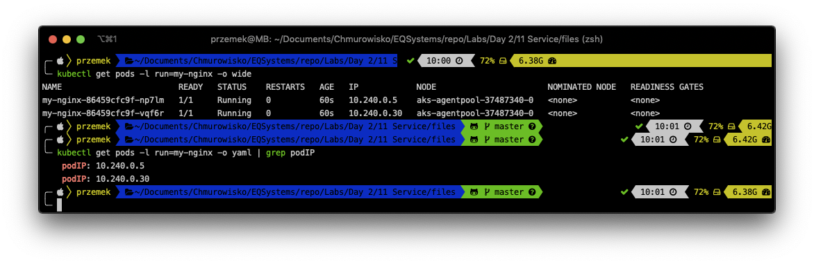

## Task 2: Creating Service

1. Create *Service* running following command:
``
kubectl expose deployment my-nginx
``
Instead, you can download [a manifest file](./files/service.yaml) and apply it using ``kubectl apply -f service.yaml``.

You created a Service which targets TCP port 80 on any Pod with the run: my-nginx label, and expose it on an abstracted Service port (targetPort: is the port the container accepts traffic on, port: is the abstracted Service port, which can be any port other pods use to access the Service)

2. Check the service: ``kubectl get service my-nginx``
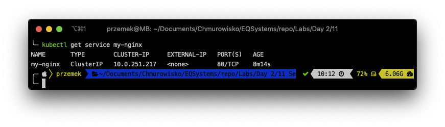

A Service is backed by a group of Pods. These Pods are exposed through endpoints. The Service’s selector will be evaluated continuously and the results will be POSTed to an Endpoints object also named my-nginx

3. Check the endpoints, and note that the IPs are the same as the Pods created in the first step: ``kubectl describe svc my-nginx ``
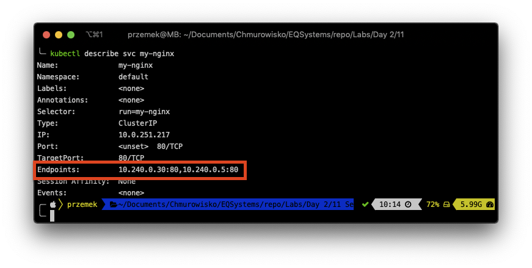

## Task 3: Accessing the Service from within the cluster using DNS

1. Check if DNS is running on the clustert: ``kubectl get services kube-dns --namespace=kube-system``
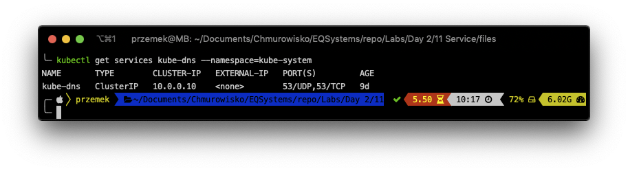
2. Use *kubectl run* to execute a container that provides the nslookup command from the dnsutils package:
``
kubectl run curl --image=radial/busyboxplus:curl -i --tty --rm
``
3. Inside the container run: ``nslookup my-nginx``
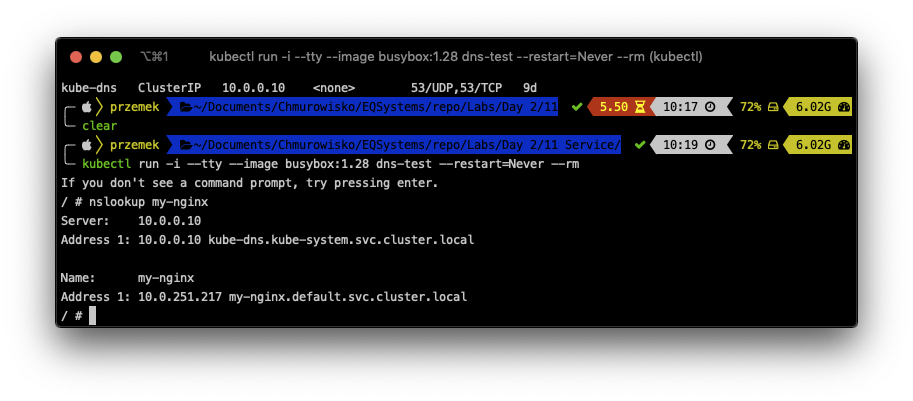

4. Still inside the container try getting data from *my-nginx* service:
``curl my-nginx.default.svc.cluster.local``
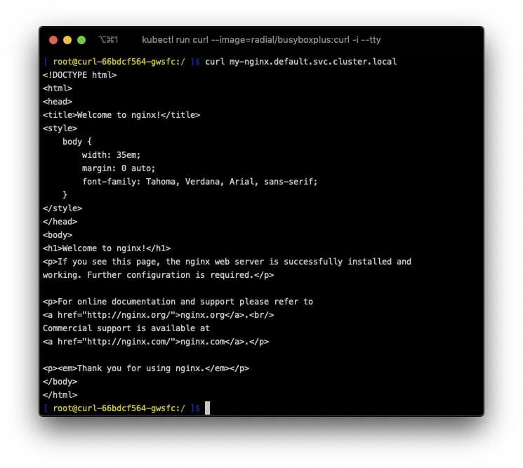

## Task 4: Exposing the Service

Kubernetes supports two ways of doing this: *NodePorts* and *LoadBalancers*. You'll create a load balancer.

1. Run ``kubectl edit svc my-nginx`` and set type to **LoadBalancer**. Save changes.
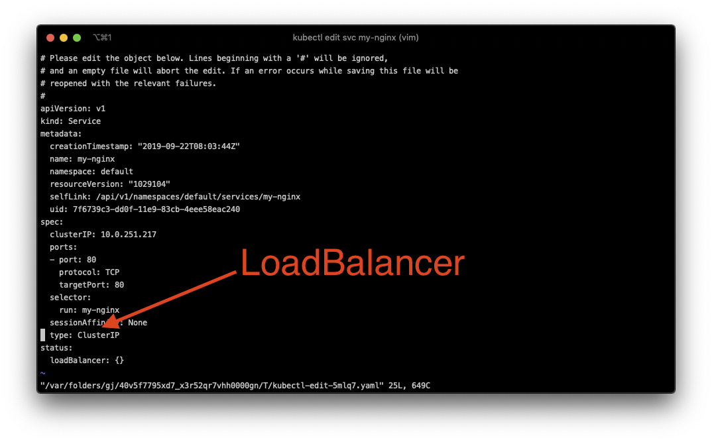
2. Run ``kubectl get svc my-nginx -w`` and wait for **EXTERNAL-IP
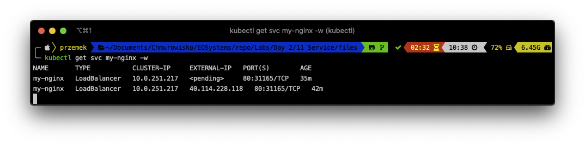
3. Using any browser og your choice, navigate to **EXTERNAL-IP** address
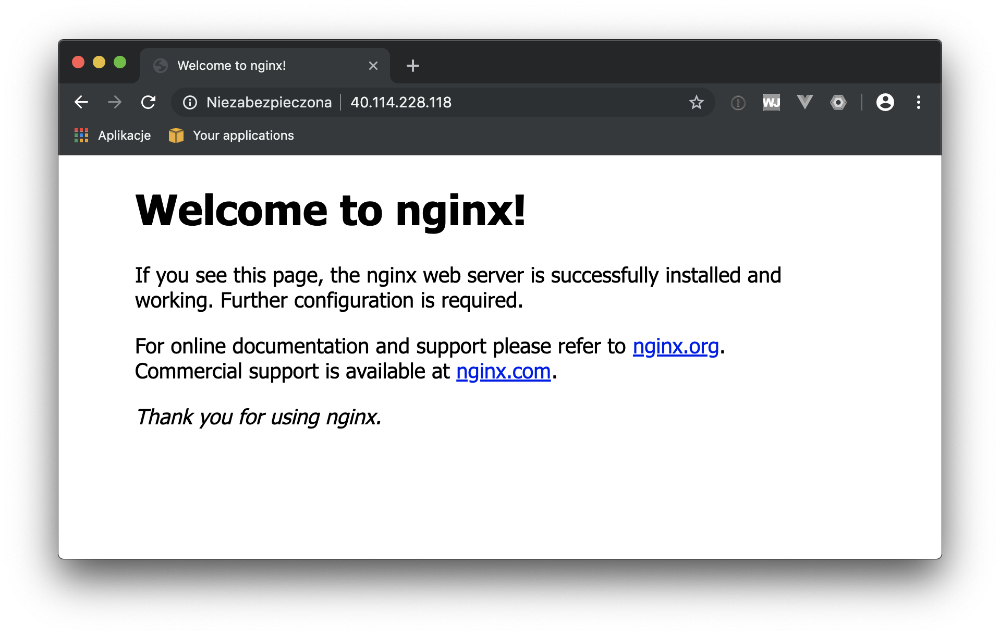

Your service is now exposed to the world. There was a Load Balancer created automatically.

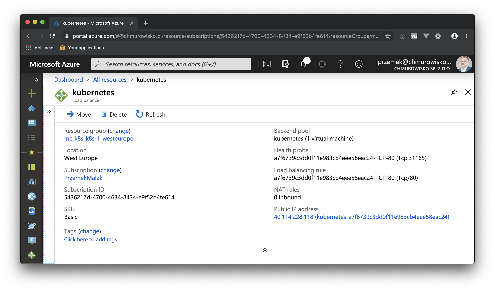

4. Describe the service: ``kubectl describe service my-nginx``

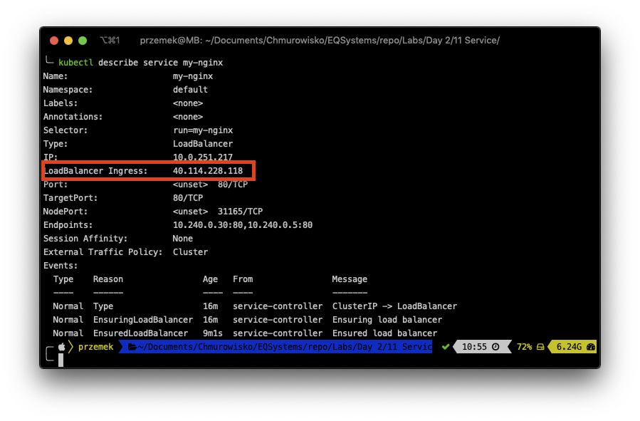

there, you also have your Load Balances Ingress IP.

5. Please, delete the service:
``
kubectl delete service my-nginx
``
and deployment
``
kubectl delete deployment my-nginx
``

## END LAB