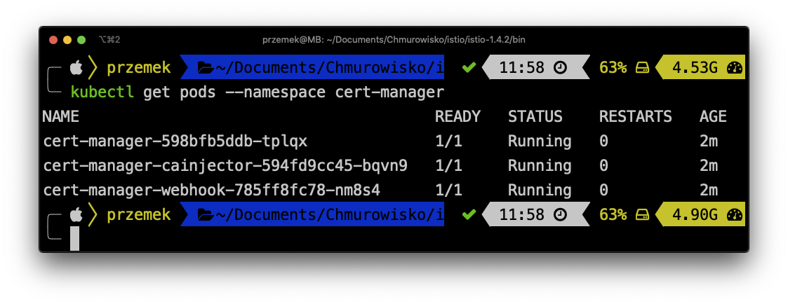
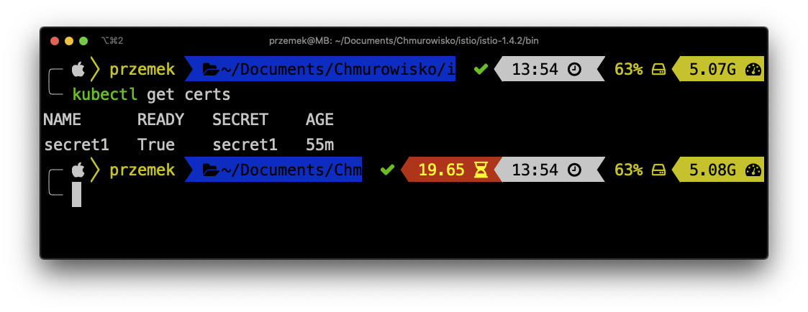

<br><br>
<br><br>
<br><br>

# TSL

## LAB Overview

#### In this lab you will create TSL certificate


## Task1: Creating an nginx controller

**This step is necessary only if you haven't deployed nginx ingress controller yet!!!**

1. Download [ingress manifest file](files/1_ingress_nginx.yaml).
2. Execute following command:
```
kubectl apply -f 1_ingress_nginx.yaml
```
3. Check if everything went fine by running:
```
kubectl get svc -n ingress-nginx
```
There should be a service of type *LoadBalancer* created for you. Please copy the *EXTERNAL-IP* of the service.


## Task 2: Creating nginx deployment

1. Download [nginx manifest file](files/2_deployment.yaml).
2. Run following command to deploy *nginx*
```
kubectl apply -f 2_deployment.yaml
```
Now, you should have your *nginx* up and running.

## Task 3: Creating ingress for nginx deployment

1. Download [ingress manifest file](files/3_simple_ingress.yaml).
2. Execute following command to deploy ingress for your *nginx* service:
```
kubectl apply -f 3_simple_ingress.yaml
```
3. Using any browser of your choise open *http://<EXTERNAL-IP-OF-YOUR-INGRESS>*


## Task 4: Adding *cert manager*.

1. Create a namespace for the *cert-manager* by execuing following command:
```
kubectl create namespace cert-manager
```
2. Instal the *cert-manager* by executing:
```
kubectl apply --validate=false -f https://github.com/jetstack/cert-manager/releases/download/v0.12.0/cert-manager.yaml
```

3. Verify the installation by executing:
```
kubectl get pods --namespace cert-manager
```


You should see the cert-manager, cert-manager-cainjector, and cert-manager-webhook pod in a Running state.

## Task 4: Configure the *cert-manager* for using *Let's Encrypt* issuer.

1. Download [manifest file](files/4_issuer.yaml).
2. Execute following command:
```
kubectl apply -f 4_issuer.yaml -n cert-manager
```

## Task 5: Creating DNS record

1. Using your DNS provider set your subdomain ie.: *tls.azure.cloudemo.eu* **A** record to IP of your ingress **EXTERNAL IP**.

## Task 6: Creating certificate and changing ingress

1. Download [certificate manifest file](files/5_certificate.yaml).
2. Execute following command to create a certificate:
```
kubectl apply -f 5_certificate.yaml
```
3. Download [ingress manifest file](files/6_ingress.yaml)
4. Change ingress configuration by executing following command:
```
kubectl apply -f 6_ingress.yaml
```
5. Check if the certificate is is ready state by executing:
```
kubectl get certs
```

7. Using any browser of your choice, try opening following url *https:<YOUR-DOMAIN>


## END LAB
