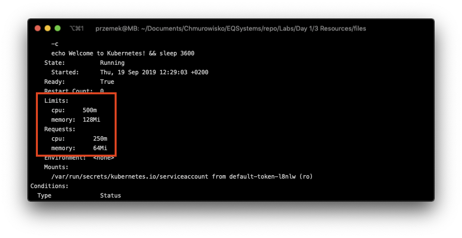

  
  
  

# Pod's resources management

## LAB Overview

#### In this lab you will create a Kubernetes pod with resource requirements and limits

## Task 1: Creating a pod 

1. Create new file by typing ``nano pod.yaml``.
2. Download [manifest file](./files/pod.yaml) and paste its content into editor.
3. Save changes by pressing *CTRL+O* and *CTRL-X*.
4. Type ``kubectl create -f pod.yaml`` and press enter.
5. Check if there is a pod created by typing ``kubectl get pods``.

## Task 2: Examinig pod settings

1. If the pod is ready and running execute following command:
``
kubectl describe pod my-resources-pod
``
2. Examine results and see if there are requirements and limits set for the pod.

3. Delete the pod using ``kubectl delete pod my-resources-pod --grace-period=1`` command.

## Task 3: Deploy pod that has high requirements
1. Create new pod using `kubectl create -f stress.yaml`. This pod uses "vish/stress" image that will make some stress tests. Note that pod is allowed to use only 1 CPU.
2. After the pod is created examine it's CPU usage: `kubectl top pod cpu-stress-pod`. Note CPU usage. It shouldn't exceed the limit.
3. Delete the pod: `kubectl delete pod cpu-stress-pod`
4. Modify **stress.yaml** file and change resources **requests** and **limits** to "100".
5. Create the pod again: `kubectl create -f stress.yaml`
6. Describe the pod: `kubectl describe pod cpu-stress-pod`. Note that scheduler failed to schedule a pod due to insufficient resources available.
7. Delete the pod `kubectl delete pod cpu-stress-pod`

## END LAB