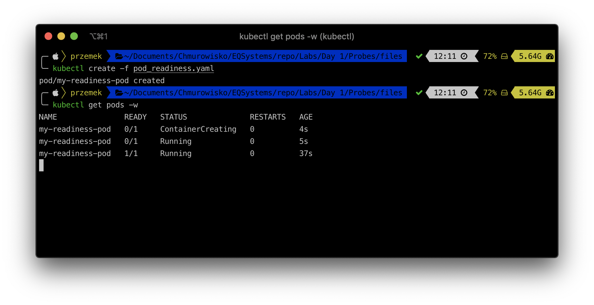

  
  
  

# Creating pods with liveness and readiness probes

## LAB Overview

#### In this lab you will create a Kubernetes pod with Liveness and Readiness probes

## Task 1: Creating a pod with a liveness probe

1. Create new file by typing ``nano pod_liveness.yaml``.
2. Download [manifest file](./files/pod_liveness.yaml) and paste its content into editor.
3. Save changes by pressing *CTRL+O* and *CTRL-X*.
4. Type ``kubectl create -f pod_liveness.yaml`` and press enter.
5. Check if there is a pod created by typing ``kubectl get pods``.
6. Check wheter or not the **STATUS** field is set to *Running*. If so, the liveness probe has passed.
7. Delete the pod using ``kubectl delete pod my-liveness-pod --grace-period=1`` command.

## Task 2: Creating pod with readiness probe.
1. Create new file by typing ``nano pod_readiness.yaml``.
2. Download [manifest file](./files/pod_readiness.yaml) and paste its content into editor.
3. Save changes by pressing *CTRL+O* and *CTRL-X*.
4. Type ``kubectl create -f pod_readiness.yaml`` and press enter.
5. Check if there is a pod created by typing ``kubectl get pods``.
6. Check wheter or not the **READY** field is set to *1/1*. If so, the readinessness probe has passed.
7. Delete the pod using``kubectl delete pod my-readiness-pod --grace-period=1`` command
8. Edit the manifest file by executing command ``nano  pod_readiness.yaml``.
9. Change initialDelaySeconds to *30* and save the file.
10. Check pod status using following command: ``kubectl get pods -w``. Compare **STATUS** and **READY FIELD**. Wait for pod to be ready.

11. Press **CTRL+C**.
12. Delete the pod using ``kubectl delete pod my-readiness-pod --grace-period=1`` command.
## END LAB

  
