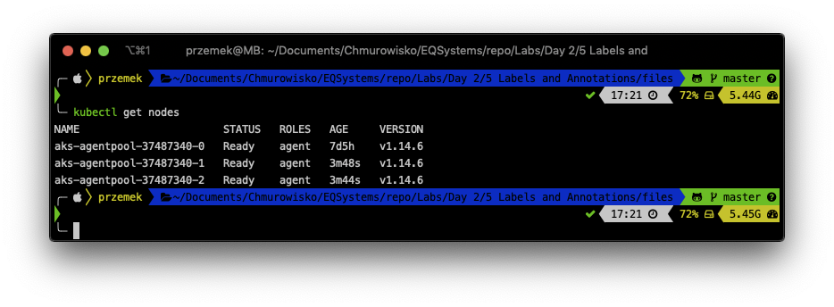
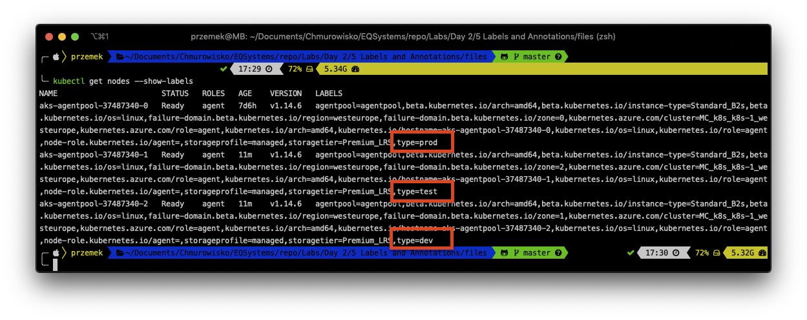
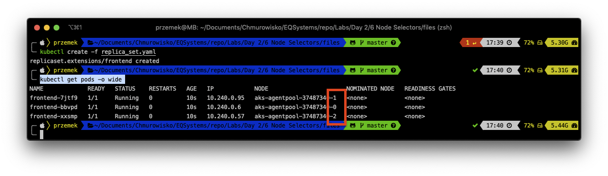
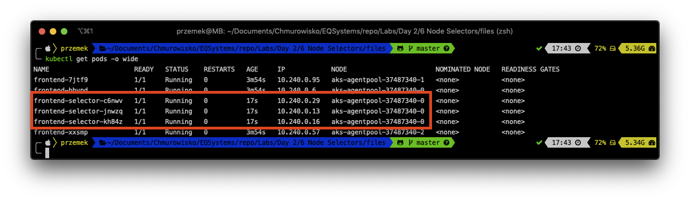

  
  
  

# Working with NodeSelectors

## LAB Overview

#### In this lab you will work with Pods using NodeSelectors

## Task 1: Adding labels to cluster nodes

1. For this lab you need at least two nodes. To check if there are any nodes available, type ``kubectl get nodes`` and press **Enter**.
You should get at least two nodes.

Please write down all node names. 
2. Add labels to all your nodes using following command:
``
kubectl label nodes <node-name> <label-key>=<label-value>
``
Set label **type** to three different values, i.e.
Of course, if you have two nodes, use just two out of those three commands.
* ``kubectl label nodes aks-agentpool-37487340-0 type=prod``
* ``kubectl label nodes aks-agentpool-37487340-1 type=test``
* ``kubectl label nodes aks-agentpool-37487340-2 type=dev``
3. Verify the labels by running:
``
kubectl get nodes --show-labels
``

## Task 2: Creating ReplicaSet of nginx Pods

1. Create new file by typing ``nano replica_set.yaml``.
2. Download [manifest file](./files/replica_set.yaml) and paste its content into editor.
3. Save changes by pressing *CTRL+O* and *CTRL-X*.
4. Type ``kubectl create -f replica_set.yaml`` and press enter.
5. Get the list of pods by tunning:
``
kubectl get pods -o wide
``
All pods are spread across all nodes

## Task 3: Creating ReplicaSet of nginx Pods on prod node

1. Create new file by typing ``nano replica_set_node_selector.yaml``.
2. Download [manifest file](./files/replica_set_node_selector.yaml) and paste its content into editor.
3. Save changes by pressing *CTRL+O* and *CTRL-X*.
4. Type ``kubectl create -f replica_set_node_selector.yaml`` and press enter.
5. Get the list of pods by tunning:
``
kubectl get pods -o wide
``
Now, all three pods are running on *prod* node.

6. Please delete ReplicaSets by running:
``
kubectl delete -f replica_set.yaml
kubectl delete -f replica_set_node_selector.yaml
``

## END LAB
